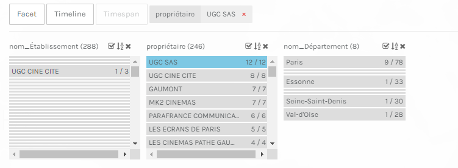
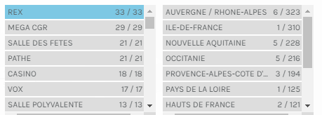
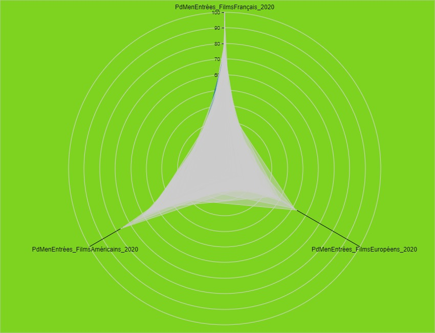

# Examen_ACourtin_2022_datavisualisation

## Contexte du projet   

<div style="text-align: justify"> Dans le cadre de notre cours portant sur l'Analyse des données et Datavisualisation, j'ai choisi de travailler sur les établissement cinématographiques français actifs au 31.12.2020. Le but dérriere ce travail est de pouvoir mettre en exergue via une visualisation (carte, graphique etc.) certaines données liées à ces établissement.  </div> 
<div style="text-align: justify"> Ainsi, nous nous sommes concentrés à visualiser les données tellesque le nombre de ces établissemnts sur une région donnée par exemple voire une vue par département (ceux de l'île-de-france) ainsi que leurs emplacements, mais aussi de ressorir certaines informations utiles comme les établissements qui sont des multiplexe(plusde 8 écrans) ainsi que leurs coordonnées ou encore celles relatives aux parts de marchés sur une année par type de films (français, européens, américains).   
De prime abord, il convient de noter que ce travail a été réalisé à l'aide d'un jeu de données sur les établissements cinématographiques en France.   
 En outre, j'ai beaucoup joué sur le filtrage de ce fichier afin de pouvoir travailler sur les données d'une région en l'occurence celles des établissements se trouvant en Ile-de-France. En effet, la majeure partie de mon travail s'est concentré sur cette région.  </div> 
Ce jeu de donnée est disponible sur le portail opendata du Ministère de la culture [Géolocalisation des établissements cinématographiques en France](https://data.culture.gouv.fr/explore/dataset/etablissements-cinematographiques/information/?dataChart=eyJxdWVyaWVzIjpbeyJjaGFydHMiOlt7InR5cGUiOiJjb2x1bW4iLCJmdW5jIjoiQ09VTlQiLCJzY2llbnRpZmljRGlzcGxheSI6dHJ1ZSwiY29sb3IiOiIjOGRhMGNiIn1dLCJ4QXhpcyI6InJlZ2lvbl9hZG1pbmlzdHJhdGl2ZSIsIm1heHBvaW50cyI6NTAsInNvcnQiOiIiLCJjb25maWciOnsiZGF0YXNldCI6ImV0YWJsaXNzZW1lbnRzLWNpbmVtYXRvZ3JhcGhpcXVlcyIsIm9wdGlvbnMiOnt9fX1dLCJ0aW1lc2NhbGUiOiIiLCJkaXNwbGF5TGVnZW5kIjp0cnVlLCJhbGlnbk1vbnRoIjp0cnVlfQ%3D%3D&location=5,46.53754,2.40395)  
Par ailleurs, dans une démarche comparative des données, j'ai un peu travaillé aussi sur un autre jeu de donné traitant uniquement les établissements cinématographiques se trouvant en Ile-de-France. Ce dernier est disponible sur le portail opendata de la région [les salles de cinéma en Ile-de-France ](https://data.iledefrance.fr/explore/dataset/les_salles_de_cinemas_en_ile-de-france/information/?location=10,49.07117,2.34764&basemap=jawg.streets)   

**Outils utilisés** : Opendatasoft, Palladio, Rawgraph, OpenRefine.      

### Visualisation avec Opendatasoft des salles de cinéma en Ile-de-France    
- **Aperçu des salles de cinéma en île-de-France selon leur situation géographique**   
 
<iframe frameborder="0" width="800" height="600" src="https://data.opendatasoft.com/map/embed/sallescinematographiques_iledefrance/?&static=false&scrollWheelZoom=false"></iframe>   

- **Graphique sur le nombre d'établissemnts par département de la région**   

<iframe src="https://data.opendatasoft.com/chart/embed/sallesdecinemapardepartement_ile-de-france/?&static=false&datasetcard=false" width="400" height="300" frameborder="0"></iframe>   

- **Explication et Analyse**   
<div style="text-align: justify">
Dans cette datavisualisation, avec la carte, j'ai éssayé de représenter les salles de cinéma à travers leur situation géographique en Ile-de-France. Ici, la situation géographique est établie par trois (3) zones : *Paris*, *la Petite couronne* et *la Grande couronne*. Ainsi, les marqueurs en bleu représentent les établissemnets situés à Paris (75), ceux en vert représentent les salles qui sont localisées sur la Grande couronne et enfin les marqueurs en violet sont ceux de la Petite couronne. L'objectif ici était donc de montrer la répartion de ces établissements au niveau de la région.    
Pour le graphique, le but était d'avoir des chiffres sur la répartion de ces établissements au niveau départemental. Ainsi, on peut voir le département de Paris (75) en tête avec 78 établissements sur les 310 présents dans la région, vient ensuite le département des Hauts-de-Seine (92) avec 42 salles. Le département de Val-d'Oise(95) dispose le plus faible nombre d'établissements avec 28 salles.   
 </div>


### Visualisation sur le nombre d'établissements cinématographiques français   
- **Graphique montrant le nombre des établissments par région**   

<iframe src="https://data.opendatasoft.com/chart/embed/etablissementscinematographiques_par_region/?&static=false&datasetcard=false" width="400" height="300" frameborder="0"></iframe>    

- **Explication et Analyse**   
<div style="text-align: justify">
Cette graphique a été réalisée sur Opendatasoft afin de ressortir les informations sur le nombre d'établissemnts cinématographiques à l'échelle nationale. A cet éffet, on peut voir que c'est la région d'Auverge-Rhône-Alpes qui occupe la première place avec ses 323 établissements, suivi de l'Ile-de-France avec 310 établissements, puis la Nouvelle-Aquitaine avec 228 établissements. La Corse est la région ayant le moins d'établissements avec 17 établissemnts. 
  </div>

### Cartographie des établissements dits Multiplexe dans toute la France   
- **Aperçu des multplexes localisées en France**   

<iframe frameborder="0" width="800" height="600" src="https://data.opendatasoft.com/map/embed/cinemamultiplex_france/?&static=false&scrollWheelZoom=false"></iframe>   

- **Explication et Analyse**   
<div style="text-align: justify">
Cette visualisation a été faite sur Opendatasoft où le but est de pouvoir localiser les établissements cinématographiques disposant plus de 8 écrans (multiplexe) et ce dans toute la France. De ce fait on peut se faire également une idée sur la région hébergeant plus d'établissements multiplexe. Ainsi, on peut nettement voir que c'est la région d'Ile-de-France qui rafle la mise, ce qu'on peut qualifier de paradoxe dans la mesure où la région est à la deuxiéme position dérrière Auverge-Rhône-Alpes en terme de nombre d'établissements cinématographiques.   
   </div>   
   
   ### Quelques captures sur le travail fait sur Palladio   
   - **Capture 1**
   
       
   
   - **Explication**   
   Cette capture montre le nombre d'établissements cinématographiques se trouvant en Ile-de-France et ayant comme propriétaire UGC SAS. On voit qu'ils sont au nombre de 12 et dont les 9 se trouvent dans Paris (75).   
   
   - **Capture 2**   
   
      
   
   - **Explication**  
   Ce second capture montre le nombre d'établissements cinématographiques se trouvant en France dont le propriétaire est Rex. A cet effet, on peut voir qu'ils sont au nombre de 33 dont 6 se trouve en région d'Auvergne et seulement un seul en Ile-de-France.   
   
   ### Visualisation sur Rawgraphs   
   - **Aperçu sur la part de marché en entrée des films en 2020**
   
       
   
   -- **Explication et Analyse**   
   
   Cette visualisation a été réalisée sur Rawgraphs, l'objectif est de montrer la part de marché de trois (3) types de films (français, américains et européens) en 2020 dans le cinéma français. Ainsi, naturellement c'est les films français qui viennent en tête, suivi des films américains et les films européens. 
   
   ### Traitement OpenRefine    
   - **Explication de la démarche**   

J'ai procédé à quelques traitement du fichier de mon jeu de donnée sur Openrefine. Ainsi, j'ai renommé quelques colonnes et puis j'ai rajouté également une colonne sur les noms de départements car y'avait que les numéros de département qui figuraient dans le jeu de données.   

- **Historique de traitement**
   
```json
[
  {
    "op": "core/column-rename",
    "oldColumnName": "nom",
    "newColumnName": "nom_Établissement ",
    "description": "Rename column nom to nom_Établissement "
  },
  {
    "op": "core/column-rename",
    "oldColumnName": "DEP",
    "newColumnName": "n°_Département ",
    "description": "Rename column DEP to n°_Département "
  },
  {
    "op": "core/column-rename",
    "oldColumnName": "population de la commune",
    "newColumnName": "population_ParCommune",
    "description": "Rename column population de la commune to population_ParCommune"
  },
  {
    "op": "core/column-addition",
    "engineConfig": {
      "facets": [],
      "mode": "row-based"
    },
    "baseColumnName": "n°_Département ",
    "expression": "grel:value",
    "onError": "set-to-blank",
    "newColumnName": "nom_Département",
    "columnInsertIndex": 8,
    "description": "Create column nom_Département at index 8 based on column n°_Département  using expression grel:value"
  },
  {
    "op": "core/mass-edit",
    "engineConfig": {
      "facets": [],
      "mode": "row-based"
    },
    "columnName": "nom_Département",
    "expression": "value",
    "edits": [
      {
        "from": [
          "01"
        ],
        "fromBlank": false,
        "fromError": false,
        "to": "Ain"
      }
    ],
    "description": "Mass edit cells in column nom_Département"
  },
  {
    "op": "core/mass-edit",
    "engineConfig": {
      "facets": [],
      "mode": "row-based"
    },
    "columnName": "nom_Département",
    "expression": "value",
    "edits": [
      {
        "from": [
          "02"
        ],
        "fromBlank": false,
        "fromError": false,
        "to": "Aisne"
      }
    ],
    "description": "Mass edit cells in column nom_Département"
  },
  {
    "op": "core/mass-edit",
    "engineConfig": {
      "facets": [],
      "mode": "row-based"
    },
    "columnName": "nom_Département",
    "expression": "value",
    "edits": [
      {
        "from": [
          "03"
        ],
        "fromBlank": false,
        "fromError": false,
        "to": "Allier"
      }
    ],
    "description": "Mass edit cells in column nom_Département"
  },
  {
    "op": "core/mass-edit",
    "engineConfig": {
      "facets": [],
      "mode": "row-based"
    },
    "columnName": "nom_Département",
    "expression": "value",
    "edits": [
      {
        "from": [
          "04"
        ],
        "fromBlank": false,
        "fromError": false,
        "to": "Alpes-de-Haute-Provence "
      }
    ],
    "description": "Mass edit cells in column nom_Département"
  },
  {
    "op": "core/mass-edit",
    "engineConfig": {
      "facets": [],
      "mode": "row-based"
    },
    "columnName": "nom_Département",
    "expression": "value",
    "edits": [
      {
        "from": [
          "05"
        ],
        "fromBlank": false,
        "fromError": false,
        "to": "Hautes-Alpes "
      }
    ],
    "description": "Mass edit cells in column nom_Département"
  },
  {
    "op": "core/mass-edit",
    "engineConfig": {
      "facets": [],
      "mode": "row-based"
    },
    "columnName": "nom_Département",
    "expression": "value",
    "edits": [
      {
        "from": [
          "06"
        ],
        "fromBlank": false,
        "fromError": false,
        "to": "Alpes-Maritimes "
      }
    ],
    "description": "Mass edit cells in column nom_Département"
  },
  {
    "op": "core/mass-edit",
    "engineConfig": {
      "facets": [],
      "mode": "row-based"
    },
    "columnName": "nom_Département",
    "expression": "value",
    "edits": [
      {
        "from": [
          "07"
        ],
        "fromBlank": false,
        "fromError": false,
        "to": "Ardèche "
      }
    ],
    "description": "Mass edit cells in column nom_Département"
  },
  {
    "op": "core/mass-edit",
    "engineConfig": {
      "facets": [],
      "mode": "row-based"
    },
    "columnName": "nom_Département",
    "expression": "value",
    "edits": [
      {
        "from": [
          "08"
        ],
        "fromBlank": false,
        "fromError": false,
        "to": "Ardennes "
      }
    ],
    "description": "Mass edit cells in column nom_Département"
  },
  {
    "op": "core/mass-edit",
    "engineConfig": {
      "facets": [],
      "mode": "row-based"
    },
    "columnName": "nom_Département",
    "expression": "value",
    "edits": [
      {
        "from": [
          "09"
        ],
        "fromBlank": false,
        "fromError": false,
        "to": "Ariège "
      }
    ],
    "description": "Mass edit cells in column nom_Département"
  },
  {
    "op": "core/mass-edit",
    "engineConfig": {
      "facets": [],
      "mode": "row-based"
    },
    "columnName": "nom_Département",
    "expression": "value",
    "edits": [
      {
        "from": [
          "10"
        ],
        "fromBlank": false,
        "fromError": false,
        "to": "Aube"
      }
    ],
    "description": "Mass edit cells in column nom_Département"
  },
  {
    "op": "core/mass-edit",
    "engineConfig": {
      "facets": [],
      "mode": "row-based"
    },
    "columnName": "nom_Département",
    "expression": "value",
    "edits": [
      {
        "from": [
          "11"
        ],
        "fromBlank": false,
        "fromError": false,
        "to": "Aude"
      }
    ],
    "description": "Mass edit cells in column nom_Département"
  },
  {
    "op": "core/mass-edit",
    "engineConfig": {
      "facets": [],
      "mode": "row-based"
    },
    "columnName": "nom_Département",
    "expression": "value",
    "edits": [
      {
        "from": [
          "12"
        ],
        "fromBlank": false,
        "fromError": false,
        "to": "Aveyron "
      }
    ],
    "description": "Mass edit cells in column nom_Département"
  },
  {
    "op": "core/mass-edit",
    "engineConfig": {
      "facets": [],
      "mode": "row-based"
    },
    "columnName": "nom_Département",
    "expression": "value",
    "edits": [
      {
        "from": [
          "13"
        ],
        "fromBlank": false,
        "fromError": false,
        "to": "Bouches-du-Rhône "
      }
    ],
    "description": "Mass edit cells in column nom_Département"
  },
  {
    "op": "core/mass-edit",
    "engineConfig": {
      "facets": [],
      "mode": "row-based"
    },
    "columnName": "nom_Département",
    "expression": "value",
    "edits": [
      {
        "from": [
          "14"
        ],
        "fromBlank": false,
        "fromError": false,
        "to": "Calvados "
      }
    ],
    "description": "Mass edit cells in column nom_Département"
  },
  {
    "op": "core/mass-edit",
    "engineConfig": {
      "facets": [],
      "mode": "row-based"
    },
    "columnName": "nom_Département",
    "expression": "value",
    "edits": [
      {
        "from": [
          "15"
        ],
        "fromBlank": false,
        "fromError": false,
        "to": "Cantal"
      }
    ],
    "description": "Mass edit cells in column nom_Département"
  },
  {
    "op": "core/mass-edit",
    "engineConfig": {
      "facets": [],
      "mode": "row-based"
    },
    "columnName": "nom_Département",
    "expression": "value",
    "edits": [
      {
        "from": [
          "16"
        ],
        "fromBlank": false,
        "fromError": false,
        "to": "Charente "
      }
    ],
    "description": "Mass edit cells in column nom_Département"
  },
  {
    "op": "core/mass-edit",
    "engineConfig": {
      "facets": [],
      "mode": "row-based"
    },
    "columnName": "nom_Département",
    "expression": "value",
    "edits": [
      {
        "from": [
          "17"
        ],
        "fromBlank": false,
        "fromError": false,
        "to": "Charente-Maritime "
      }
    ],
    "description": "Mass edit cells in column nom_Département"
  },
  {
    "op": "core/mass-edit",
    "engineConfig": {
      "facets": [],
      "mode": "row-based"
    },
    "columnName": "nom_Département",
    "expression": "value",
    "edits": [
      {
        "from": [
          "18"
        ],
        "fromBlank": false,
        "fromError": false,
        "to": "Cher"
      }
    ],
    "description": "Mass edit cells in column nom_Département"
  },
  {
    "op": "core/mass-edit",
    "engineConfig": {
      "facets": [],
      "mode": "row-based"
    },
    "columnName": "nom_Département",
    "expression": "value",
    "edits": [
      {
        "from": [
          "19"
        ],
        "fromBlank": false,
        "fromError": false,
        "to": "Corrèze "
      }
    ],
    "description": "Mass edit cells in column nom_Département"
  },
  {
    "op": "core/mass-edit",
    "engineConfig": {
      "facets": [],
      "mode": "row-based"
    },
    "columnName": "nom_Département",
    "expression": "value",
    "edits": [
      {
        "from": [
          "21"
        ],
        "fromBlank": false,
        "fromError": false,
        "to": "Côte-d'Or"
      }
    ],
    "description": "Mass edit cells in column nom_Département"
  },
  {
    "op": "core/mass-edit",
    "engineConfig": {
      "facets": [],
      "mode": "row-based"
    },
    "columnName": "nom_Département",
    "expression": "value",
    "edits": [
      {
        "from": [
          "22"
        ],
        "fromBlank": false,
        "fromError": false,
        "to": "Côtes-d'Armor "
      }
    ],
    "description": "Mass edit cells in column nom_Département"
  },
  {
    "op": "core/mass-edit",
    "engineConfig": {
      "facets": [],
      "mode": "row-based"
    },
    "columnName": "nom_Département",
    "expression": "value",
    "edits": [
      {
        "from": [
          "23"
        ],
        "fromBlank": false,
        "fromError": false,
        "to": "Creuse"
      }
    ],
    "description": "Mass edit cells in column nom_Département"
  },
  {
    "op": "core/mass-edit",
    "engineConfig": {
      "facets": [],
      "mode": "row-based"
    },
    "columnName": "nom_Département",
    "expression": "value",
    "edits": [
      {
        "from": [
          "24"
        ],
        "fromBlank": false,
        "fromError": false,
        "to": "Dordogne"
      }
    ],
    "description": "Mass edit cells in column nom_Département"
  },
  {
    "op": "core/mass-edit",
    "engineConfig": {
      "facets": [],
      "mode": "row-based"
    },
    "columnName": "nom_Département",
    "expression": "value",
    "edits": [
      {
        "from": [
          "25"
        ],
        "fromBlank": false,
        "fromError": false,
        "to": "Doubs"
      }
    ],
    "description": "Mass edit cells in column nom_Département"
  },
  {
    "op": "core/mass-edit",
    "engineConfig": {
      "facets": [],
      "mode": "row-based"
    },
    "columnName": "nom_Département",
    "expression": "value",
    "edits": [
      {
        "from": [
          "26"
        ],
        "fromBlank": false,
        "fromError": false,
        "to": "Drôme "
      }
    ],
    "description": "Mass edit cells in column nom_Département"
  },
  {
    "op": "core/mass-edit",
    "engineConfig": {
      "facets": [],
      "mode": "row-based"
    },
    "columnName": "nom_Département",
    "expression": "value",
    "edits": [
      {
        "from": [
          "27"
        ],
        "fromBlank": false,
        "fromError": false,
        "to": "Eure"
      }
    ],
    "description": "Mass edit cells in column nom_Département"
  },
  {
    "op": "core/mass-edit",
    "engineConfig": {
      "facets": [],
      "mode": "row-based"
    },
    "columnName": "nom_Département",
    "expression": "value",
    "edits": [
      {
        "from": [
          "28"
        ],
        "fromBlank": false,
        "fromError": false,
        "to": "Eure-et-Loir"
      }
    ],
    "description": "Mass edit cells in column nom_Département"
  },
  {
    "op": "core/mass-edit",
    "engineConfig": {
      "facets": [],
      "mode": "row-based"
    },
    "columnName": "nom_Département",
    "expression": "value",
    "edits": [
      {
        "from": [
          "29"
        ],
        "fromBlank": false,
        "fromError": false,
        "to": "Finistère "
      }
    ],
    "description": "Mass edit cells in column nom_Département"
  },
  {
    "op": "core/mass-edit",
    "engineConfig": {
      "facets": [],
      "mode": "row-based"
    },
    "columnName": "nom_Département",
    "expression": "value",
    "edits": [
      {
        "from": [
          "2A"
        ],
        "fromBlank": false,
        "fromError": false,
        "to": "Corse-du-Sud"
      }
    ],
    "description": "Mass edit cells in column nom_Département"
  },
  {
    "op": "core/mass-edit",
    "engineConfig": {
      "facets": [],
      "mode": "row-based"
    },
    "columnName": "nom_Département",
    "expression": "value",
    "edits": [
      {
        "from": [
          "2B"
        ],
        "fromBlank": false,
        "fromError": false,
        "to": "Haute-Corse"
      }
    ],
    "description": "Mass edit cells in column nom_Département"
  },
  {
    "op": "core/mass-edit",
    "engineConfig": {
      "facets": [],
      "mode": "row-based"
    },
    "columnName": "nom_Département",
    "expression": "value",
    "edits": [
      {
        "from": [
          "30"
        ],
        "fromBlank": false,
        "fromError": false,
        "to": "Gard"
      }
    ],
    "description": "Mass edit cells in column nom_Département"
  },
  {
    "op": "core/mass-edit",
    "engineConfig": {
      "facets": [],
      "mode": "row-based"
    },
    "columnName": "nom_Département",
    "expression": "value",
    "edits": [
      {
        "from": [
          "31"
        ],
        "fromBlank": false,
        "fromError": false,
        "to": "Haute-Garonne "
      }
    ],
    "description": "Mass edit cells in column nom_Département"
  },
  {
    "op": "core/mass-edit",
    "engineConfig": {
      "facets": [],
      "mode": "row-based"
    },
    "columnName": "nom_Département",
    "expression": "value",
    "edits": [
      {
        "from": [
          "32"
        ],
        "fromBlank": false,
        "fromError": false,
        "to": "Gers"
      }
    ],
    "description": "Mass edit cells in column nom_Département"
  },
  {
    "op": "core/mass-edit",
    "engineConfig": {
      "facets": [],
      "mode": "row-based"
    },
    "columnName": "nom_Département",
    "expression": "value",
    "edits": [
      {
        "from": [
          "33"
        ],
        "fromBlank": false,
        "fromError": false,
        "to": "Gironde"
      }
    ],
    "description": "Mass edit cells in column nom_Département"
  },
  {
    "op": "core/mass-edit",
    "engineConfig": {
      "facets": [],
      "mode": "row-based"
    },
    "columnName": "nom_Département",
    "expression": "value",
    "edits": [
      {
        "from": [
          "34"
        ],
        "fromBlank": false,
        "fromError": false,
        "to": "Hérault "
      }
    ],
    "description": "Mass edit cells in column nom_Département"
  },
  {
    "op": "core/mass-edit",
    "engineConfig": {
      "facets": [],
      "mode": "row-based"
    },
    "columnName": "nom_Département",
    "expression": "value",
    "edits": [
      {
        "from": [
          "35"
        ],
        "fromBlank": false,
        "fromError": false,
        "to": "Ille-et-Vilaine "
      }
    ],
    "description": "Mass edit cells in column nom_Département"
  },
  {
    "op": "core/mass-edit",
    "engineConfig": {
      "facets": [],
      "mode": "row-based"
    },
    "columnName": "nom_Département",
    "expression": "value",
    "edits": [
      {
        "from": [
          "36"
        ],
        "fromBlank": false,
        "fromError": false,
        "to": "Indre"
      }
    ],
    "description": "Mass edit cells in column nom_Département"
  },
  {
    "op": "core/mass-edit",
    "engineConfig": {
      "facets": [],
      "mode": "row-based"
    },
    "columnName": "nom_Département",
    "expression": "value",
    "edits": [
      {
        "from": [
          "37"
        ],
        "fromBlank": false,
        "fromError": false,
        "to": "Indre-et-Loire "
      }
    ],
    "description": "Mass edit cells in column nom_Département"
  },
  {
    "op": "core/mass-edit",
    "engineConfig": {
      "facets": [],
      "mode": "row-based"
    },
    "columnName": "nom_Département",
    "expression": "value",
    "edits": [
      {
        "from": [
          "38"
        ],
        "fromBlank": false,
        "fromError": false,
        "to": "Isère "
      }
    ],
    "description": "Mass edit cells in column nom_Département"
  },
  {
    "op": "core/mass-edit",
    "engineConfig": {
      "facets": [],
      "mode": "row-based"
    },
    "columnName": "nom_Département",
    "expression": "value",
    "edits": [
      {
        "from": [
          "39"
        ],
        "fromBlank": false,
        "fromError": false,
        "to": "Jura"
      }
    ],
    "description": "Mass edit cells in column nom_Département"
  },
  {
    "op": "core/mass-edit",
    "engineConfig": {
      "facets": [],
      "mode": "row-based"
    },
    "columnName": "nom_Département",
    "expression": "value",
    "edits": [
      {
        "from": [
          "40"
        ],
        "fromBlank": false,
        "fromError": false,
        "to": "Landes "
      }
    ],
    "description": "Mass edit cells in column nom_Département"
  },
  {
    "op": "core/mass-edit",
    "engineConfig": {
      "facets": [],
      "mode": "row-based"
    },
    "columnName": "nom_Département",
    "expression": "value",
    "edits": [
      {
        "from": [
          "41"
        ],
        "fromBlank": false,
        "fromError": false,
        "to": "Loir-et-Cher"
      }
    ],
    "description": "Mass edit cells in column nom_Département"
  },
  {
    "op": "core/mass-edit",
    "engineConfig": {
      "facets": [],
      "mode": "row-based"
    },
    "columnName": "nom_Département",
    "expression": "value",
    "edits": [
      {
        "from": [
          "42"
        ],
        "fromBlank": false,
        "fromError": false,
        "to": "Loire"
      }
    ],
    "description": "Mass edit cells in column nom_Département"
  },
  {
    "op": "core/mass-edit",
    "engineConfig": {
      "facets": [],
      "mode": "row-based"
    },
    "columnName": "nom_Département",
    "expression": "value",
    "edits": [
      {
        "from": [
          "43"
        ],
        "fromBlank": false,
        "fromError": false,
        "to": "Haute-Loire"
      }
    ],
    "description": "Mass edit cells in column nom_Département"
  },
  {
    "op": "core/mass-edit",
    "engineConfig": {
      "facets": [],
      "mode": "row-based"
    },
    "columnName": "nom_Département",
    "expression": "value",
    "edits": [
      {
        "from": [
          "44"
        ],
        "fromBlank": false,
        "fromError": false,
        "to": "Loire-Atlantique "
      }
    ],
    "description": "Mass edit cells in column nom_Département"
  },
  {
    "op": "core/mass-edit",
    "engineConfig": {
      "facets": [],
      "mode": "row-based"
    },
    "columnName": "nom_Département",
    "expression": "value",
    "edits": [
      {
        "from": [
          "45"
        ],
        "fromBlank": false,
        "fromError": false,
        "to": "Loiret"
      }
    ],
    "description": "Mass edit cells in column nom_Département"
  },
  {
    "op": "core/mass-edit",
    "engineConfig": {
      "facets": [],
      "mode": "row-based"
    },
    "columnName": "nom_Département",
    "expression": "value",
    "edits": [
      {
        "from": [
          "46"
        ],
        "fromBlank": false,
        "fromError": false,
        "to": "Lot"
      }
    ],
    "description": "Mass edit cells in column nom_Département"
  },
  {
    "op": "core/mass-edit",
    "engineConfig": {
      "facets": [],
      "mode": "row-based"
    },
    "columnName": "nom_Département",
    "expression": "value",
    "edits": [
      {
        "from": [
          "47"
        ],
        "fromBlank": false,
        "fromError": false,
        "to": "Lot-et-Garonne "
      }
    ],
    "description": "Mass edit cells in column nom_Département"
  },
  {
    "op": "core/mass-edit",
    "engineConfig": {
      "facets": [],
      "mode": "row-based"
    },
    "columnName": "nom_Département",
    "expression": "value",
    "edits": [
      {
        "from": [
          "48"
        ],
        "fromBlank": false,
        "fromError": false,
        "to": "Lozère "
      }
    ],
    "description": "Mass edit cells in column nom_Département"
  },
  {
    "op": "core/mass-edit",
    "engineConfig": {
      "facets": [],
      "mode": "row-based"
    },
    "columnName": "nom_Département",
    "expression": "value",
    "edits": [
      {
        "from": [
          "49"
        ],
        "fromBlank": false,
        "fromError": false,
        "to": "Maine-et-Loire "
      }
    ],
    "description": "Mass edit cells in column nom_Département"
  },
  {
    "op": "core/mass-edit",
    "engineConfig": {
      "facets": [],
      "mode": "row-based"
    },
    "columnName": "nom_Département",
    "expression": "value",
    "edits": [
      {
        "from": [
          "50"
        ],
        "fromBlank": false,
        "fromError": false,
        "to": "Manche "
      }
    ],
    "description": "Mass edit cells in column nom_Département"
  },
  {
    "op": "core/mass-edit",
    "engineConfig": {
      "facets": [],
      "mode": "row-based"
    },
    "columnName": "nom_Département",
    "expression": "value",
    "edits": [
      {
        "from": [
          "51"
        ],
        "fromBlank": false,
        "fromError": false,
        "to": "Marne"
      }
    ],
    "description": "Mass edit cells in column nom_Département"
  },
  {
    "op": "core/mass-edit",
    "engineConfig": {
      "facets": [],
      "mode": "row-based"
    },
    "columnName": "nom_Département",
    "expression": "value",
    "edits": [
      {
        "from": [
          "52"
        ],
        "fromBlank": false,
        "fromError": false,
        "to": "Haute-Marne"
      }
    ],
    "description": "Mass edit cells in column nom_Département"
  },
  {
    "op": "core/mass-edit",
    "engineConfig": {
      "facets": [],
      "mode": "row-based"
    },
    "columnName": "nom_Département",
    "expression": "value",
    "edits": [
      {
        "from": [
          "53"
        ],
        "fromBlank": false,
        "fromError": false,
        "to": "Mayenne "
      }
    ],
    "description": "Mass edit cells in column nom_Département"
  },
  {
    "op": "core/mass-edit",
    "engineConfig": {
      "facets": [],
      "mode": "row-based"
    },
    "columnName": "nom_Département",
    "expression": "value",
    "edits": [
      {
        "from": [
          "54"
        ],
        "fromBlank": false,
        "fromError": false,
        "to": "Meurthe-et-Moselle "
      }
    ],
    "description": "Mass edit cells in column nom_Département"
  },
  {
    "op": "core/mass-edit",
    "engineConfig": {
      "facets": [],
      "mode": "row-based"
    },
    "columnName": "nom_Département",
    "expression": "value",
    "edits": [
      {
        "from": [
          "55"
        ],
        "fromBlank": false,
        "fromError": false,
        "to": "Meuse"
      }
    ],
    "description": "Mass edit cells in column nom_Département"
  },
  {
    "op": "core/mass-edit",
    "engineConfig": {
      "facets": [],
      "mode": "row-based"
    },
    "columnName": "nom_Département",
    "expression": "value",
    "edits": [
      {
        "from": [
          "56"
        ],
        "fromBlank": false,
        "fromError": false,
        "to": "Morbihan "
      }
    ],
    "description": "Mass edit cells in column nom_Département"
  },
  {
    "op": "core/mass-edit",
    "engineConfig": {
      "facets": [],
      "mode": "row-based"
    },
    "columnName": "nom_Département",
    "expression": "value",
    "edits": [
      {
        "from": [
          "57"
        ],
        "fromBlank": false,
        "fromError": false,
        "to": "Moselle "
      }
    ],
    "description": "Mass edit cells in column nom_Département"
  },
  {
    "op": "core/mass-edit",
    "engineConfig": {
      "facets": [],
      "mode": "row-based"
    },
    "columnName": "nom_Département",
    "expression": "value",
    "edits": [
      {
        "from": [
          "58"
        ],
        "fromBlank": false,
        "fromError": false,
        "to": "Nièvre "
      }
    ],
    "description": "Mass edit cells in column nom_Département"
  },
  {
    "op": "core/mass-edit",
    "engineConfig": {
      "facets": [],
      "mode": "row-based"
    },
    "columnName": "nom_Département",
    "expression": "value",
    "edits": [
      {
        "from": [
          "59"
        ],
        "fromBlank": false,
        "fromError": false,
        "to": "Nord"
      }
    ],
    "description": "Mass edit cells in column nom_Département"
  },
  {
    "op": "core/mass-edit",
    "engineConfig": {
      "facets": [],
      "mode": "row-based"
    },
    "columnName": "nom_Département",
    "expression": "value",
    "edits": [
      {
        "from": [
          "60"
        ],
        "fromBlank": false,
        "fromError": false,
        "to": "Oise"
      }
    ],
    "description": "Mass edit cells in column nom_Département"
  },
  {
    "op": "core/mass-edit",
    "engineConfig": {
      "facets": [],
      "mode": "row-based"
    },
    "columnName": "nom_Département",
    "expression": "value",
    "edits": [
      {
        "from": [
          "61"
        ],
        "fromBlank": false,
        "fromError": false,
        "to": "Orne"
      }
    ],
    "description": "Mass edit cells in column nom_Département"
  },
  {
    "op": "core/mass-edit",
    "engineConfig": {
      "facets": [],
      "mode": "row-based"
    },
    "columnName": "nom_Département",
    "expression": "value",
    "edits": [
      {
        "from": [
          "62"
        ],
        "fromBlank": false,
        "fromError": false,
        "to": "Pas-de-Calais"
      }
    ],
    "description": "Mass edit cells in column nom_Département"
  },
  {
    "op": "core/mass-edit",
    "engineConfig": {
      "facets": [],
      "mode": "row-based"
    },
    "columnName": "nom_Département",
    "expression": "value",
    "edits": [
      {
        "from": [
          "63"
        ],
        "fromBlank": false,
        "fromError": false,
        "to": "Puy-de-Dôme "
      }
    ],
    "description": "Mass edit cells in column nom_Département"
  },
  {
    "op": "core/mass-edit",
    "engineConfig": {
      "facets": [],
      "mode": "row-based"
    },
    "columnName": "nom_Département",
    "expression": "value",
    "edits": [
      {
        "from": [
          "64"
        ],
        "fromBlank": false,
        "fromError": false,
        "to": "Pyrénées-Atlantiques "
      }
    ],
    "description": "Mass edit cells in column nom_Département"
  },
  {
    "op": "core/mass-edit",
    "engineConfig": {
      "facets": [],
      "mode": "row-based"
    },
    "columnName": "nom_Département",
    "expression": "value",
    "edits": [
      {
        "from": [
          "65"
        ],
        "fromBlank": false,
        "fromError": false,
        "to": "Hautes-Pyrénées "
      }
    ],
    "description": "Mass edit cells in column nom_Département"
  },
  {
    "op": "core/mass-edit",
    "engineConfig": {
      "facets": [],
      "mode": "row-based"
    },
    "columnName": "nom_Département",
    "expression": "value",
    "edits": [
      {
        "from": [
          "66"
        ],
        "fromBlank": false,
        "fromError": false,
        "to": "Pyrénées-Orientales"
      }
    ],
    "description": "Mass edit cells in column nom_Département"
  },
  {
    "op": "core/mass-edit",
    "engineConfig": {
      "facets": [],
      "mode": "row-based"
    },
    "columnName": "nom_Département",
    "expression": "value",
    "edits": [
      {
        "from": [
          "67"
        ],
        "fromBlank": false,
        "fromError": false,
        "to": "Bas-Rhin"
      }
    ],
    "description": "Mass edit cells in column nom_Département"
  },
  {
    "op": "core/mass-edit",
    "engineConfig": {
      "facets": [],
      "mode": "row-based"
    },
    "columnName": "nom_Département",
    "expression": "value",
    "edits": [
      {
        "from": [
          "68"
        ],
        "fromBlank": false,
        "fromError": false,
        "to": "Haut-Rhin"
      }
    ],
    "description": "Mass edit cells in column nom_Département"
  },
  {
    "op": "core/mass-edit",
    "engineConfig": {
      "facets": [],
      "mode": "row-based"
    },
    "columnName": "nom_Département",
    "expression": "value",
    "edits": [
      {
        "from": [
          "69"
        ],
        "fromBlank": false,
        "fromError": false,
        "to": "Rhône "
      }
    ],
    "description": "Mass edit cells in column nom_Département"
  },
  {
    "op": "core/mass-edit",
    "engineConfig": {
      "facets": [],
      "mode": "row-based"
    },
    "columnName": "nom_Département",
    "expression": "value",
    "edits": [
      {
        "from": [
          "70"
        ],
        "fromBlank": false,
        "fromError": false,
        "to": "Haute-Saône "
      }
    ],
    "description": "Mass edit cells in column nom_Département"
  },
  {
    "op": "core/mass-edit",
    "engineConfig": {
      "facets": [],
      "mode": "row-based"
    },
    "columnName": "nom_Département",
    "expression": "value",
    "edits": [
      {
        "from": [
          "71"
        ],
        "fromBlank": false,
        "fromError": false,
        "to": "Saône-et-Loire "
      }
    ],
    "description": "Mass edit cells in column nom_Département"
  },
  {
    "op": "core/mass-edit",
    "engineConfig": {
      "facets": [],
      "mode": "row-based"
    },
    "columnName": "nom_Département",
    "expression": "value",
    "edits": [
      {
        "from": [
          "72"
        ],
        "fromBlank": false,
        "fromError": false,
        "to": "Sarthe "
      }
    ],
    "description": "Mass edit cells in column nom_Département"
  },
  {
    "op": "core/mass-edit",
    "engineConfig": {
      "facets": [],
      "mode": "row-based"
    },
    "columnName": "nom_Département",
    "expression": "value",
    "edits": [
      {
        "from": [
          "73"
        ],
        "fromBlank": false,
        "fromError": false,
        "to": "Savoie"
      }
    ],
    "description": "Mass edit cells in column nom_Département"
  },
  {
    "op": "core/mass-edit",
    "engineConfig": {
      "facets": [],
      "mode": "row-based"
    },
    "columnName": "nom_Département",
    "expression": "value",
    "edits": [
      {
        "from": [
          "74"
        ],
        "fromBlank": false,
        "fromError": false,
        "to": "Haute-Savoie"
      }
    ],
    "description": "Mass edit cells in column nom_Département"
  },
  {
    "op": "core/mass-edit",
    "engineConfig": {
      "facets": [],
      "mode": "row-based"
    },
    "columnName": "nom_Département",
    "expression": "value",
    "edits": [
      {
        "from": [
          "75"
        ],
        "fromBlank": false,
        "fromError": false,
        "to": "Paris"
      }
    ],
    "description": "Mass edit cells in column nom_Département"
  },
  {
    "op": "core/mass-edit",
    "engineConfig": {
      "facets": [],
      "mode": "row-based"
    },
    "columnName": "nom_Département",
    "expression": "value",
    "edits": [
      {
        "from": [
          "76"
        ],
        "fromBlank": false,
        "fromError": false,
        "to": "Seine-Maritime"
      }
    ],
    "description": "Mass edit cells in column nom_Département"
  },
  {
    "op": "core/mass-edit",
    "engineConfig": {
      "facets": [],
      "mode": "row-based"
    },
    "columnName": "nom_Département",
    "expression": "value",
    "edits": [
      {
        "from": [
          "77"
        ],
        "fromBlank": false,
        "fromError": false,
        "to": "Seine-et-Marne"
      }
    ],
    "description": "Mass edit cells in column nom_Département"
  },
  {
    "op": "core/mass-edit",
    "engineConfig": {
      "facets": [],
      "mode": "row-based"
    },
    "columnName": "nom_Département",
    "expression": "value",
    "edits": [
      {
        "from": [
          "78"
        ],
        "fromBlank": false,
        "fromError": false,
        "to": "Yvelines "
      }
    ],
    "description": "Mass edit cells in column nom_Département"
  },
  {
    "op": "core/mass-edit",
    "engineConfig": {
      "facets": [],
      "mode": "row-based"
    },
    "columnName": "nom_Département",
    "expression": "value",
    "edits": [
      {
        "from": [
          "79"
        ],
        "fromBlank": false,
        "fromError": false,
        "to": "Deux-Sèvres"
      }
    ],
    "description": "Mass edit cells in column nom_Département"
  },
  {
    "op": "core/mass-edit",
    "engineConfig": {
      "facets": [],
      "mode": "row-based"
    },
    "columnName": "nom_Département",
    "expression": "value",
    "edits": [
      {
        "from": [
          "80"
        ],
        "fromBlank": false,
        "fromError": false,
        "to": "Somme"
      }
    ],
    "description": "Mass edit cells in column nom_Département"
  },
  {
    "op": "core/mass-edit",
    "engineConfig": {
      "facets": [],
      "mode": "row-based"
    },
    "columnName": "nom_Département",
    "expression": "value",
    "edits": [
      {
        "from": [
          "81"
        ],
        "fromBlank": false,
        "fromError": false,
        "to": "Tarn"
      }
    ],
    "description": "Mass edit cells in column nom_Département"
  },
  {
    "op": "core/mass-edit",
    "engineConfig": {
      "facets": [],
      "mode": "row-based"
    },
    "columnName": "nom_Département",
    "expression": "value",
    "edits": [
      {
        "from": [
          "82"
        ],
        "fromBlank": false,
        "fromError": false,
        "to": "Tarn-et-Garonne "
      }
    ],
    "description": "Mass edit cells in column nom_Département"
  },
  {
    "op": "core/mass-edit",
    "engineConfig": {
      "facets": [],
      "mode": "row-based"
    },
    "columnName": "nom_Département",
    "expression": "value",
    "edits": [
      {
        "from": [
          "83"
        ],
        "fromBlank": false,
        "fromError": false,
        "to": "Var"
      }
    ],
    "description": "Mass edit cells in column nom_Département"
  },
  {
    "op": "core/mass-edit",
    "engineConfig": {
      "facets": [],
      "mode": "row-based"
    },
    "columnName": "nom_Département",
    "expression": "value",
    "edits": [
      {
        "from": [
          "84"
        ],
        "fromBlank": false,
        "fromError": false,
        "to": "Vaucluse "
      }
    ],
    "description": "Mass edit cells in column nom_Département"
  },
  {
    "op": "core/mass-edit",
    "engineConfig": {
      "facets": [],
      "mode": "row-based"
    },
    "columnName": "nom_Département",
    "expression": "value",
    "edits": [
      {
        "from": [
          "85"
        ],
        "fromBlank": false,
        "fromError": false,
        "to": "Vendée "
      }
    ],
    "description": "Mass edit cells in column nom_Département"
  },
  {
    "op": "core/mass-edit",
    "engineConfig": {
      "facets": [],
      "mode": "row-based"
    },
    "columnName": "nom_Département",
    "expression": "value",
    "edits": [
      {
        "from": [
          "86"
        ],
        "fromBlank": false,
        "fromError": false,
        "to": "Vienne"
      }
    ],
    "description": "Mass edit cells in column nom_Département"
  },
  {
    "op": "core/mass-edit",
    "engineConfig": {
      "facets": [],
      "mode": "row-based"
    },
    "columnName": "nom_Département",
    "expression": "value",
    "edits": [
      {
        "from": [
          "87"
        ],
        "fromBlank": false,
        "fromError": false,
        "to": "Haute-Vienne"
      }
    ],
    "description": "Mass edit cells in column nom_Département"
  },
  {
    "op": "core/mass-edit",
    "engineConfig": {
      "facets": [],
      "mode": "row-based"
    },
    "columnName": "nom_Département",
    "expression": "value",
    "edits": [
      {
        "from": [
          "88"
        ],
        "fromBlank": false,
        "fromError": false,
        "to": "Vosges "
      }
    ],
    "description": "Mass edit cells in column nom_Département"
  },
  {
    "op": "core/mass-edit",
    "engineConfig": {
      "facets": [],
      "mode": "row-based"
    },
    "columnName": "nom_Département",
    "expression": "value",
    "edits": [
      {
        "from": [
          "89"
        ],
        "fromBlank": false,
        "fromError": false,
        "to": "Yonne "
      }
    ],
    "description": "Mass edit cells in column nom_Département"
  },
  {
    "op": "core/mass-edit",
    "engineConfig": {
      "facets": [],
      "mode": "row-based"
    },
    "columnName": "nom_Département",
    "expression": "value",
    "edits": [
      {
        "from": [
          "90"
        ],
        "fromBlank": false,
        "fromError": false,
        "to": "Territoire de Belfort "
      }
    ],
    "description": "Mass edit cells in column nom_Département"
  },
  {
    "op": "core/mass-edit",
    "engineConfig": {
      "facets": [],
      "mode": "row-based"
    },
    "columnName": "nom_Département",
    "expression": "value",
    "edits": [
      {
        "from": [
          "91"
        ],
        "fromBlank": false,
        "fromError": false,
        "to": "Essonne "
      }
    ],
    "description": "Mass edit cells in column nom_Département"
  },
  {
    "op": "core/mass-edit",
    "engineConfig": {
      "facets": [],
      "mode": "row-based"
    },
    "columnName": "nom_Département",
    "expression": "value",
    "edits": [
      {
        "from": [
          "92"
        ],
        "fromBlank": false,
        "fromError": false,
        "to": "Hauts-de-Seine "
      }
    ],
    "description": "Mass edit cells in column nom_Département"
  },
  {
    "op": "core/mass-edit",
    "engineConfig": {
      "facets": [],
      "mode": "row-based"
    },
    "columnName": "nom_Département",
    "expression": "value",
    "edits": [
      {
        "from": [
          "93"
        ],
        "fromBlank": false,
        "fromError": false,
        "to": "Seine-Saint-Denis "
      }
    ],
    "description": "Mass edit cells in column nom_Département"
  },
  {
    "op": "core/mass-edit",
    "engineConfig": {
      "facets": [],
      "mode": "row-based"
    },
    "columnName": "nom_Département",
    "expression": "value",
    "edits": [
      {
        "from": [
          "94"
        ],
        "fromBlank": false,
        "fromError": false,
        "to": "Val-de-Marne"
      }
    ],
    "description": "Mass edit cells in column nom_Département"
  },
  {
    "op": "core/mass-edit",
    "engineConfig": {
      "facets": [],
      "mode": "row-based"
    },
    "columnName": "nom_Département",
    "expression": "value",
    "edits": [
      {
        "from": [
          "95"
        ],
        "fromBlank": false,
        "fromError": false,
        "to": "Val-d'Oise"
      }
    ],
    "description": "Mass edit cells in column nom_Département"
  },
  {
    "op": "core/column-rename",
    "oldColumnName": "écrans",
    "newColumnName": "nombre_Ecrans",
    "description": "Rename column écrans to nombre_Ecrans"
  },
  {
    "op": "core/column-rename",
    "oldColumnName": "fauteuils",
    "newColumnName": "nombre_Fauteuils",
    "description": "Rename column fauteuils to nombre_Fauteuils"
  },
  {
    "op": "core/column-rename",
    "oldColumnName": "semaines d'activité",
    "newColumnName": "semaines_d'Activité",
    "description": "Rename column semaines d'activité to semaines_d'Activité"
  },
  {
    "op": "core/mass-edit",
    "engineConfig": {
      "facets": [],
      "mode": "row-based"
    },
    "columnName": "nom_Département",
    "expression": "value",
    "edits": [
      {
        "from": [
          "Eure"
        ],
        "fromBlank": false,
        "fromError": false,
        "to": "Eure"
      }
    ],
    "description": "Mass edit cells in column nom_Département"
  },
  {
    "op": "core/column-rename",
    "oldColumnName": "entrées 2020",
    "newColumnName": "nbreEntrées_2020",
    "description": "Rename column entrées 2020 to nbreEntrées_2020"
  },
  {
    "op": "core/column-rename",
    "oldColumnName": "entrées 2019",
    "newColumnName": "nbred'Entrées_2019",
    "description": "Rename column entrées 2019 to nbred'Entrées_2019"
  },
  {
    "op": "core/column-rename",
    "oldColumnName": "nbreEntrées_2020",
    "newColumnName": "nbred'Entrées_2020",
    "description": "Rename column nbreEntrées_2020 to nbred'Entrées_2020"
  },
  {
    "op": "core/column-rename",
    "oldColumnName": "évolution entrées",
    "newColumnName": "évolution_Entrées",
    "description": "Rename column évolution entrées to évolution_Entrées"
  },
  {
    "op": "core/column-rename",
    "oldColumnName": "tranche d'entrées",
    "newColumnName": "tranche_d'Entrées",
    "description": "Rename column tranche d'entrées to tranche_d'Entrées"
  },
  {
    "op": "core/column-removal",
    "columnName": "geolocalisation",
    "description": "Remove column geolocalisation"
  },
  {
    "op": "core/column-rename",
    "oldColumnName": "latitude",
    "newColumnName": "coord_Latitude",
    "description": "Rename column latitude to coord_Latitude"
  },
  {
    "op": "core/column-rename",
    "oldColumnName": "longitude",
    "newColumnName": "coord_Longitude",
    "description": "Rename column longitude to coord_Longitude"
  },
  {
    "op": "core/column-rename",
    "oldColumnName": "AE",
    "newColumnName": "films_ArtetEssai",
    "description": "Rename column AE to films_ArtetEssai"
  },
  {
    "op": "core/column-rename",
    "oldColumnName": "adresse",
    "newColumnName": "adresse_Établissement ",
    "description": "Rename column adresse to adresse_Établissement "
  },
  {
    "op": "core/text-transform",
    "engineConfig": {
      "facets": [],
      "mode": "row-based"
    },
    "columnName": "adresse_Établissement ",
    "expression": "value.toLowercase()",
    "onError": "keep-original",
    "repeat": false,
    "repeatCount": 10,
    "description": "Text transform on cells in column adresse_Établissement  using expression value.toLowercase()"
  },
  {
    "op": "core/text-transform",
    "engineConfig": {
      "facets": [],
      "mode": "row-based"
    },
    "columnName": "région administrative",
    "expression": "value.toLowercase()",
    "onError": "keep-original",
    "repeat": false,
    "repeatCount": 10,
    "description": "Text transform on cells in column région administrative using expression value.toLowercase()"
  },
  {
    "op": "core/mass-edit",
    "engineConfig": {
      "facets": [],
      "mode": "row-based"
    },
    "columnName": "région administrative",
    "expression": "value",
    "edits": [
      {
        "from": [
          "auvergne / rhone-alpes"
        ],
        "fromBlank": false,
        "fromError": false,
        "to": "Auvergne / Rhône-Alpes"
      }
    ],
    "description": "Mass edit cells in column région administrative"
  },
  {
    "op": "core/mass-edit",
    "engineConfig": {
      "facets": [],
      "mode": "row-based"
    },
    "columnName": "région administrative",
    "expression": "value",
    "edits": [
      {
        "from": [
          "bourgogne / franche-comte"
        ],
        "fromBlank": false,
        "fromError": false,
        "to": "Bourgogne / Franche-Comté"
      }
    ],
    "description": "Mass edit cells in column région administrative"
  },
  {
    "op": "core/mass-edit",
    "engineConfig": {
      "facets": [],
      "mode": "row-based"
    },
    "columnName": "région administrative",
    "expression": "value",
    "edits": [
      {
        "from": [
          "centre-val de loire"
        ],
        "fromBlank": false,
        "fromError": false,
        "to": "Centre-Val de Loire"
      }
    ],
    "description": "Mass edit cells in column région administrative"
  },
  {
    "op": "core/mass-edit",
    "engineConfig": {
      "facets": [],
      "mode": "row-based"
    },
    "columnName": "région administrative",
    "expression": "value",
    "edits": [
      {
        "from": [
          "grand est"
        ],
        "fromBlank": false,
        "fromError": false,
        "to": "Grand Est"
      }
    ],
    "description": "Mass edit cells in column région administrative"
  },
  {
    "op": "core/mass-edit",
    "engineConfig": {
      "facets": [],
      "mode": "row-based"
    },
    "columnName": "région administrative",
    "expression": "value",
    "edits": [
      {
        "from": [
          "hauts de france"
        ],
        "fromBlank": false,
        "fromError": false,
        "to": "Hauts-de-France"
      }
    ],
    "description": "Mass edit cells in column région administrative"
  },
  {
    "op": "core/mass-edit",
    "engineConfig": {
      "facets": [],
      "mode": "row-based"
    },
    "columnName": "région administrative",
    "expression": "value",
    "edits": [
      {
        "from": [
          "ile-de-france"
        ],
        "fromBlank": false,
        "fromError": false,
        "to": "Île-de-France"
      }
    ],
    "description": "Mass edit cells in column région administrative"
  },
  {
    "op": "core/mass-edit",
    "engineConfig": {
      "facets": [],
      "mode": "row-based"
    },
    "columnName": "région administrative",
    "expression": "value",
    "edits": [
      {
        "from": [
          "normandie"
        ],
        "fromBlank": false,
        "fromError": false,
        "to": "Normandie"
      }
    ],
    "description": "Mass edit cells in column région administrative"
  },
  {
    "op": "core/mass-edit",
    "engineConfig": {
      "facets": [],
      "mode": "row-based"
    },
    "columnName": "région administrative",
    "expression": "value",
    "edits": [
      {
        "from": [
          "nouvelle aquitaine"
        ],
        "fromBlank": false,
        "fromError": false,
        "to": "Nouvelle-Aquitaine"
      }
    ],
    "description": "Mass edit cells in column région administrative"
  },
  {
    "op": "core/mass-edit",
    "engineConfig": {
      "facets": [],
      "mode": "row-based"
    },
    "columnName": "région administrative",
    "expression": "value",
    "edits": [
      {
        "from": [
          "occitanie"
        ],
        "fromBlank": false,
        "fromError": false,
        "to": "Occitanie"
      }
    ],
    "description": "Mass edit cells in column région administrative"
  },
  {
    "op": "core/mass-edit",
    "engineConfig": {
      "facets": [],
      "mode": "row-based"
    },
    "columnName": "région administrative",
    "expression": "value",
    "edits": [
      {
        "from": [
          "pays de la loire"
        ],
        "fromBlank": false,
        "fromError": false,
        "to": "Pays-de-la-Loire"
      }
    ],
    "description": "Mass edit cells in column région administrative"
  },
  {
    "op": "core/mass-edit",
    "engineConfig": {
      "facets": [],
      "mode": "row-based"
    },
    "columnName": "région administrative",
    "expression": "value",
    "edits": [
      {
        "from": [
          "provence-alpes-cote d'azur"
        ],
        "fromBlank": false,
        "fromError": false,
        "to": "Provence-Alpes-Côte d'Azur"
      }
    ],
    "description": "Mass edit cells in column région administrative"
  },
  {
    "op": "core/mass-edit",
    "engineConfig": {
      "facets": [],
      "mode": "row-based"
    },
    "columnName": "région administrative",
    "expression": "value",
    "edits": [
      {
        "from": [
          "Auvergne / Rhône-Alpes"
        ],
        "fromBlank": false,
        "fromError": false,
        "to": "Auvergne-Rhône-Alpes"
      }
    ],
    "description": "Mass edit cells in column région administrative"
  },
  {
    "op": "core/mass-edit",
    "engineConfig": {
      "facets": [],
      "mode": "row-based"
    },
    "columnName": "région administrative",
    "expression": "value",
    "edits": [
      {
        "from": [
          "Bourgogne / Franche-Comté"
        ],
        "fromBlank": false,
        "fromError": false,
        "to": "Bourgogne-Franche-Comté"
      }
    ],
    "description": "Mass edit cells in column région administrative"
  },
  {
    "op": "core/column-move",
    "columnName": "adresse_Établissement ",
    "index": 2,
    "description": "Move column adresse_Établissement  to position 2"
  },
  {
    "op": "core/column-move",
    "columnName": "commune",
    "index": 4,
    "description": "Move column commune to position 4"
  },
  {
    "op": "core/column-move",
    "columnName": "commune",
    "index": 3,
    "description": "Move column commune to position 3"
  },
  {
    "op": "core/column-move",
    "columnName": "code INSEE",
    "index": 4,
    "description": "Move column code INSEE to position 4"
  },
  {
    "op": "core/column-move",
    "columnName": "population_ParCommune",
    "index": 5,
    "description": "Move column population_ParCommune to position 5"
  },
  {
    "op": "core/column-move",
    "columnName": "population_ParCommune",
    "index": 4,
    "description": "Move column population_ParCommune to position 4"
  },
  {
    "op": "core/column-move",
    "columnName": "n°_Département ",
    "index": 6,
    "description": "Move column n°_Département  to position 6"
  },
  {
    "op": "core/column-move",
    "columnName": "nom_Département",
    "index": 7,
    "description": "Move column nom_Département to position 7"
  },
  {
    "op": "core/column-rename",
    "oldColumnName": "région administrative",
    "newColumnName": "nom_RégionAdministrative",
    "description": "Rename column région administrative to nom_RégionAdministrative"
  },
  {
    "op": "core/column-move",
    "columnName": "propriétaire",
    "index": 0,
    "description": "Move column propriétaire to position 0"
  },
  {
    "op": "core/column-move",
    "columnName": "propriétaire",
    "index": 1,
    "description": "Move column propriétaire to position 1"
  },
  {
    "op": "core/column-move",
    "columnName": "propriétaire",
    "index": 2,
    "description": "Move column propriétaire to position 2"
  }
]
```
   
   


  
